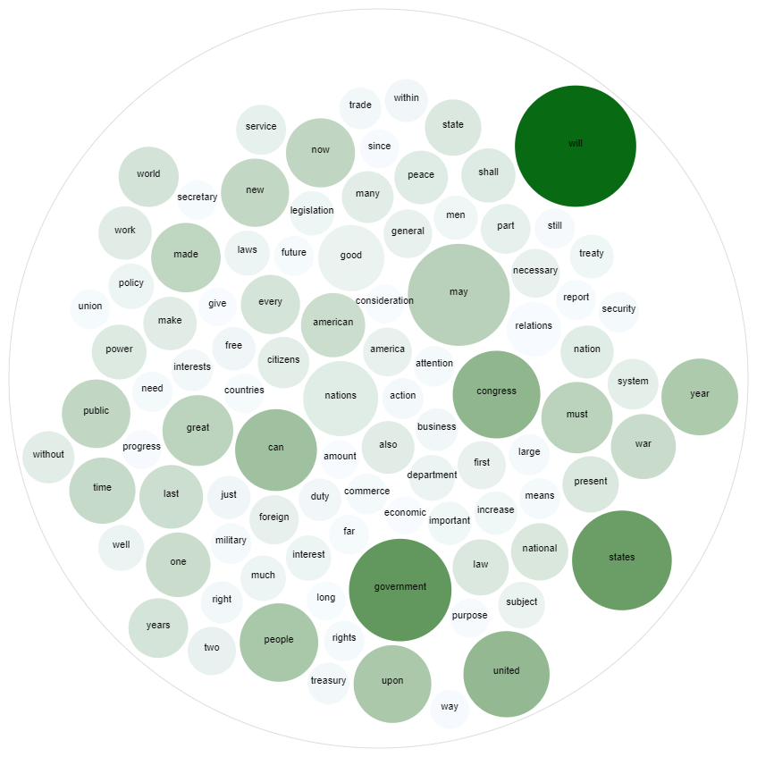

# Word Count and Pair Count Analysis
 **Analysis of State of the Union Addresses from 1790 to 2020.**
 
 The goal of this assignment was to perform
 several tasks regarding textual data. The dataset
 consisted of text transcriptions of the State of the Union Addresses, given by Presidents to
 Congress from 1790 (George Washington) to 2020 (Donald Trump).

 This project computed:
 1. Average use of every word
 2. Maximum and Minimum word count
 3. Co-occurence of words
 4. Lift between two words over the entire vocabulary

## Directory Structure:
**/All Output** (Full Text)

Contains COMPLETE text files with the output for each stage of the assignment.
File name is preceeded by the part of the assignment and explains what the files contains

**/Code/Part1.py**: Code for part 1

**/Code/Part2.py**: Code for part 2

**/ExtractHTML.py**: Code used to download all the data for the assignment

**/Sample Output**

**/Report.pdf**: Report of my findings.
Contains Sample text files with the output for each stage of the assignment. This report details all the steps necessary for duplicating my work.

File name is preceeded by the part of the assignment and explains what the files contains.

## Images in Report:

The top 50 word-averages are shown below. Each circle represents the value of the average
use of the word over all the years.
 

